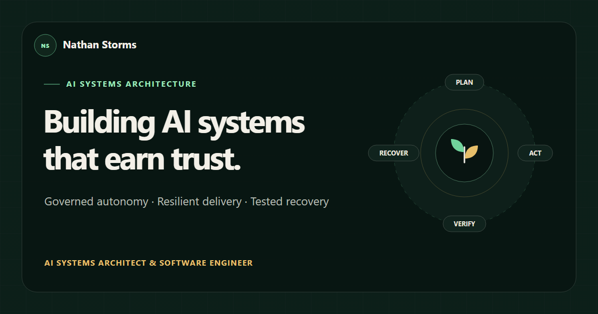

# Nathan Storms — Portfolio



A focused portfolio for my work in governed AI systems, resilient automation, and interactive web engineering.

**Live site:** [hero4383.github.io/Portfolio](https://hero4383.github.io/Portfolio/)

## Featured work

### TreeOfLife

TreeOfLife is a private multi-agent engineering platform built around bounded execution, durable context, evidence-backed delivery, operational visibility, and recovery.

The public case study intentionally describes outcomes rather than implementation details. Current verified milestones include isolated candidate workflows, validation-gated delivery, exact-version deployment, brokered local-model execution, and a clean-host restoration from an encrypted off-host checkpoint.

Longer unattended operation, deeper isolation, and broader model routing remain under active hardening. The site does not present those areas as complete.

### Interactive demonstrations

- **Agent Systems Simulator** — a canvas-based visual metaphor for role specialization, bounded work, staged handoffs, validation, and recovery.
- **Interactive 3D Model Workbench** — a browser prototype for loading, inspecting, texturing, and rendering several 3D formats.
- **Synchronized Browser Renderer** — a paired-tab experiment using local delta synchronization and WebRTC video.

These demos illustrate selected engineering concepts. They are not live TreeOfLife control surfaces or production services.

## Design principles

- Evidence before autonomy
- Explicit scope and capability boundaries
- Isolated, reversible software changes
- Exact-revision validation and deployment
- Recovery as a product capability
- Scale after measurement

## Run locally

The portfolio is a static site with no build step.

```powershell
python -m http.server 8000
```

Then open `http://localhost:8000`.

The interactive demos use browser APIs and pinned CDN libraries. Serve the repository over HTTP instead of opening files directly for the most consistent behavior.

## Repository map

```text
.
├── index.html                  # Main portfolio and TreeOfLife case study
├── assets/                     # Shared visual system and social metadata
├── container-llm-lab/         # Agent systems visualization
├── 3d-model-viewer/            # 3D workbench prototype
├── rtc-viewer/                 # Paired browser-rendering prototype
├── ai-orchestration-tutorial/  # Retirement notice for an early archive
└── bank-transfer/              # Private-instructions payment policy
```

## Disclosure boundary

TreeOfLife source and operational details are private. Public material deliberately excludes credentials, host information, internal topology, prompts, policy contracts, queue data, recovery identifiers, and other details that would weaken the system or its users.

Capability claims on the site are limited to outcomes supported by completed validation or controlled recovery exercises.

## Contact

- [Email Nathan](mailto:ittnathanstorms@gmail.com)
- [GitHub profile](https://github.com/Hero4383)

© 2026 Nathan Storms
